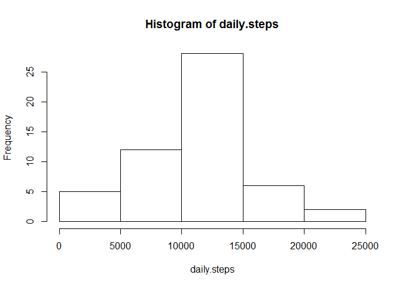
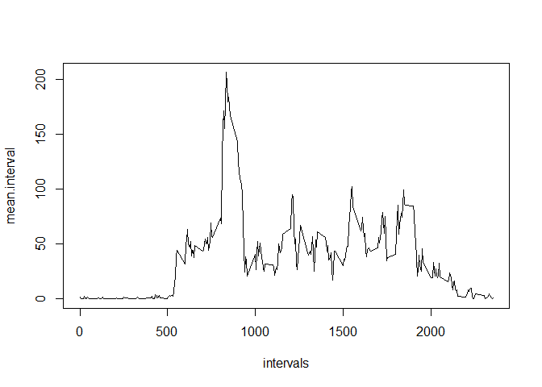
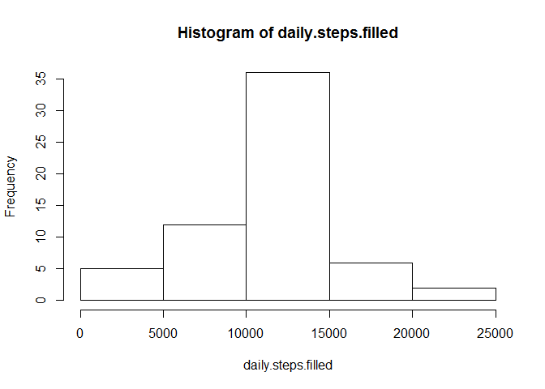

# Reproducible Research: Peer Assessment 1


## Loading and preprocessing the data
We load the .csv file and convert the date entries from string to date format.


```r
setwd('~/data/RepData_PeerAssessment1')
dt<-read.table('activity.csv',sep=',',header=T)
dt$date<-strptime(dt$date,'%Y-%m-%d')
```

## What is mean total number of steps taken per day?
We split the dataset by date and take the sum of steps per day. There are 61 days in this dataset. Next, we plot the histogram of number of steps for each day. Most days have between 10,000 and 15,000 steps.


```r
s<-split(dt,as.Date(dt$date))
daily.steps<-sapply(s,function(x) sum(x$steps))
hist(daily.steps)
```

 

```r
mean(daily.steps,na.rm=T)
```

```
## [1] 10766.19
```

```r
median(daily.steps,na.rm=T)
```

```
## [1] 10765
```


## What is the average daily activity pattern?
To investigate the averagey daily activity patern, we average each interval over all of the days that data is available, then plot as a time series by interval. Intervals 0-500 tend to have no steps, then there is a rise to between 50-100, followed by a sharp peak to over 200 steps in the interval with the highest number of steps.


```r
s<-split(dt,dt$interval)
mean.interval<-sapply(s,function(x) mean(x$steps,na.rm=T))

intervals<-as.numeric(names(mean.interval))

plot(intervals,mean.interval,type='l')
```

 

##Which 5-minute interval, on average across all the days in the dataset, contains the maximum number of steps?
We see the peak in the time series plot around interval 700. We find the precise interval with the maximum average number of steps with the following code:


```r
intervals[mean.interval==max(mean.interval)]
```

```
## [1] 835
```

## Imputing missing values
I chose to replace missing values with the average number of steps for that interval, calling the new dataset, 'filled'


```r
missing<-is.na(dt$steps)
sum(missing)
```

```
## [1] 2304
```

```r
filled<-dt
filled$steps[missing]<-mean.interval[as.character(filled$interval[missing])]

s<-split(filled,as.Date(filled$date))
```
Then we display the mean, median and histogram of average steps. Overall the data do not look terribly different from when we simply omitted the data. 


```r
daily.steps.filled<-sapply(s,function(x) sum(x$steps))
hist(daily.steps.filled)
```

 

```r
mean(daily.steps.filled)
```

```
## [1] 10766.19
```

```r
median(daily.steps.filled)
```

```
## [1] 10766.19
```
## Are there differences in activity patterns between weekdays and weekends?
To determine this, we plot the average time series as we did before, separating weekend days from weekdays. After creating the 'weekend' factor in the dataset, we use the aggregate function to separate by both weekday/weekend and interval.


```r
d<-filled

day<-weekdays(d$date)
weekend<-day=="Saturday" | day=="Sunday"
w<-numeric()
w[weekend]<-'weekend'
w[!weekend]<-'weekday'
w<-factor(w,levels=c('weekend','weekday'))
d$weekend<-w

dat<-aggregate(d$steps,by=list(d$weekend,d$interval),FUN=mean)
names(dat)<-c('weekday','interval','steps')
```
We use the lattice plotting package to create the panel plot from the aggregated data.


```r
library(lattice)
xyplot(steps~interval|weekday,data=dat,layout=c(1,2),type='l')
```

 

From this plot, we can observe several differences between weekday and weekend activity. First, the sharp increase around interval 500 on weekdays is replced by a more gradual rise. This could indicate that the subject is sleeping later on weekends. We also see a lessening of the peak that we observed in the averaged data, and an overall increase in activity. This is spectulation, but perhaps the subject exercises before work during weekdays, then is relatively sedentary during the day while at work. On weekends, the subject may sleep later, occasionaly skipping the morning workout and instead maintaining a more active daily schedule.
